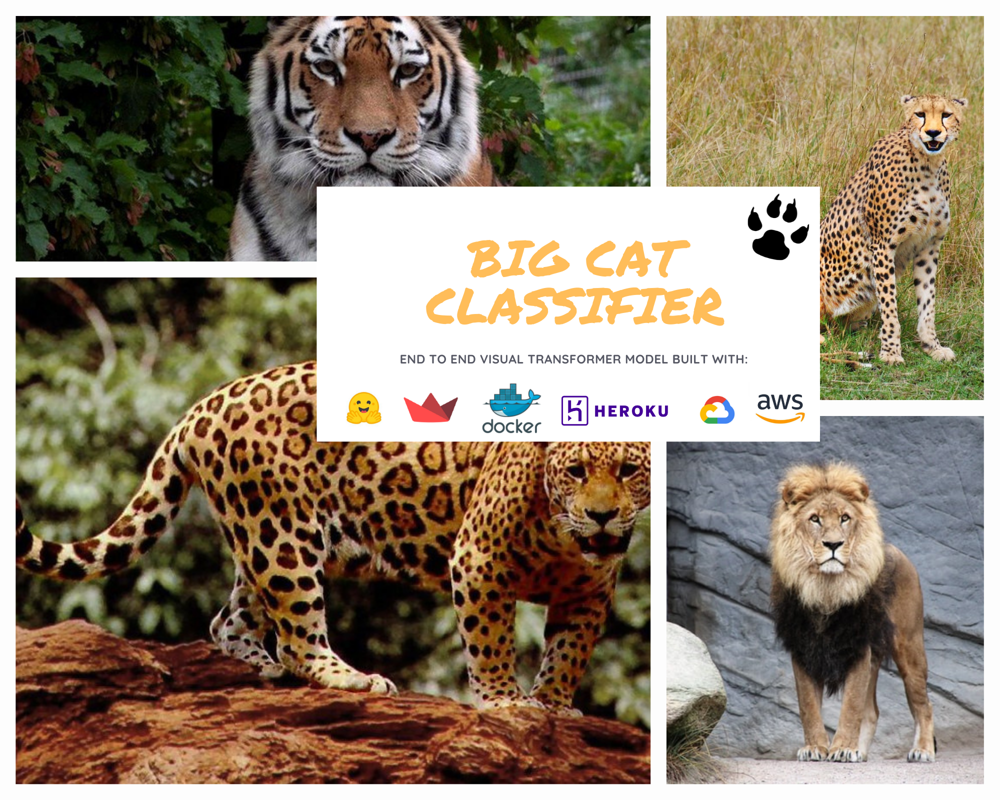

<p align = "center"></p>

An image classifier built using Vision Transformers that categories images of the big cats into the following classes:

1. Cheetah
2. Jaguar
3. Leopard
4. Lion
5. Tiger

> **Note**:
>
> - Since jaguars and leopards have similar appearances, the model might confuse the two. These [[1](https://www.nationalgeographic.com/animals/article/animals-big-cats-jaguars-leopards)] [[2](https://safarisafricana.com/jaguar-v-leopard/)] two articles throw some light on the difference between the two species.
> - Theoretically the model should be able to accurately identify geographical population variants of each species. However, in practical scenarios this may not be true as during the training phases this was not kept in mind while collecting the dataset.
>   - For example: images of Bengal Tigers, Siberian Tigers, Indochinese Tigers, and Malayan Tigers should be identified as Tigers
> - Lastly, the performance of the model in categorizing certain rare variants in the populations of big cats such as white tigers, snow leopards, or black panther has not been determined exclusively. Although some of the tests performed gave satisfactory results.

### Training and Inference

**Training**: [](https://colab.research.google.com/github/smaranjitghose/Big_Cat_Classifier/blob/master/notebooks/Big_Cat_Classifier.ipynb)

**Inference**: [](https://colab.research.google.com/github/smaranjitghose/Big_Cat_Classifier/blob/master/notebooks/Big_Cat_Classifier_Inference.ipynb)

## Usage

```python
from PIL import Image
import matplotlib.pyplot as plt
from transformers import ViTFeatureExtractor, ViTForImageClassification

def identify_big_cat(img_path:str)->str:
  """
  Function that reads an image of a big cat (belonging to Panthera family) and returns the corresponding species
  """
  img = Image.open(img_path)
  model_panthera = ViTForImageClassification.from_pretrained("smaranjitghose/big-cat-classifier")
  feature_extractor = ViTFeatureExtractor.from_pretrained('smaranjitghose/big-cat-classifier')
  inputs = feature_extractor(images=img, return_tensors="pt")
  outputs = model_panthera(**inputs)
  logits = outputs.logits
  predicted_class_idx = logits.argmax(-1).item()
  return model_panthera.config.id2label[predicted_class_idx]


 our_big_cat = identify_big_cat("path_of_the_image")
 print(f"Predicted species: {our_big_cat}" )
```

## Hosted API:

Check it out [here](https://huggingface.co/smaranjitghose/big-cat-classifier)

## Library App Usage:

- Clone this repository

```
git clone https://github.com/smaranjitghose/Big_Cat_Classifier.git
```

- Move inside the cloned repository

```
cd Big_Cat_Classifier
```

- Now follow either of following two routes:

A) Without using Docker:

**Make sure you have installed the latest stable version [Python 3](https://www.python.org/downloads/) and added it to PATH**

- Install the python dependencies

```
pip install -r requirements.txt
```

- Start the streamlit app on local server

```
streamlit run app.py
```

B) Using Docker:

**Make sure you have installed [Docker](https://docs.docker.com/engine/install/)**

- Build the Docker Image

```
docker build -t smaranjitghose/big-cat-classifier:latest .
```

- Check if the image is available

```
docker images
```

- Create a Docker container from the image and Run it

```
docker run -t -i -p 8080:8080 --name "big-cat-classifier" smaranjitghose/big-cat-classifier
```

- Open your browser and visit `localhost:8080`


## Hosting

1. Heroku

- Remove the lines that exposed the particular port in the docker container
- Make sure the startup command is exposed with a variable Port Number

```
ENTRYPOINT ["streamlit", "run", "app.py", "--server.port=$PORT"]
```

- Login to Heroku

```
heroku login -i
```

- Create a new Heroku app

```
heroku create
```

- Login in to Container Registry

```
heroku container:login
```

- Build the Docker image and push it to Container Registry

```
heroku container:push web
```

- Release the app

```
heroku container:release web
```

- Check the hosted version and dashboard

```
heroku open
```

## Reference and Acknowledgement:

[Hugging Pics](https://github.com/nateraw/huggingpics)
